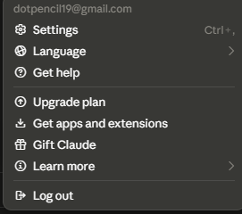
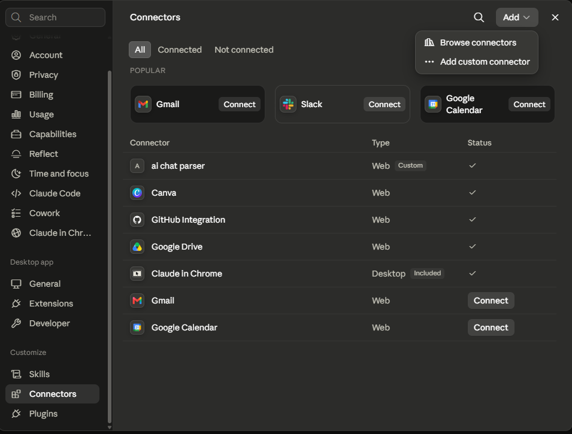
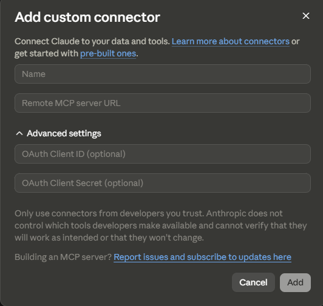

# chat-share-reader

An MCP server (and CLI) that lets **any AI read a shared ChatGPT conversation link**, plus a **browser bookmarklet** for Claude, which no server can read.

Paste a `chatgpt.com/share/...` link into your AI client and it can actually read the conversation — instead of telling you it can't open links.

```
You:  Summarise this chat → https://chatgpt.com/share/abc-123
AI:   [calls read_shared_chat] → gets the full transcript → summarises it
```

---

## Why this exists

Shared AI conversations are public web pages, but the conversation isn't in the HTML as readable text — it's embedded as an encoded React Server Components payload. Most AI clients that "browse" a link get an empty shell and give up.

This server decodes that payload properly and returns a clean, normalized transcript.

## Supported links

| Platform | URL pattern | How to read it | Why |
|---|---|---|---|
| ChatGPT | `https://chatgpt.com/share/...` | **MCP server / CLI** ✅ | The conversation ships in the page as an RSC payload this server decodes |
| ChatGPT (legacy) | `https://chat.openai.com/share/...` | **MCP server / CLI** ✅ | Same, via the older `__NEXT_DATA__` blob |
| Claude | `https://claude.ai/share/...` | **[Browser bookmarklet](bookmarklet/README.md)** — not the server | Cloudflare returns `403` (`cf-mitigated: challenge`) to every non-browser client, *and* the page is client-side rendered, so the HTML holds meta tags and no conversation |

Only **public share links** work. Private conversation URLs (`/c/...`) require your login session and are intentionally not supported.

### About Claude links

Calling the MCP tools or the CLI with a `claude.ai/share/...` URL fails immediately with `claude_not_supported` and a pointer to the bookmarklet. That's deliberate: it fails *before* fetching, because there is nothing a fetch could achieve.

Both blockers are real and independent — neither header tweaking nor a proxy nor a retry loop gets around them, and this repo doesn't try. Blocker 1 is confirmed in open issues on `anthropics/claude-code`: Claude Code can't read these links either. Blocker 2 means that even past Cloudflare, the response body contains no messages.

Your browser has already cleared the challenge and run the page's JavaScript by the time you're looking at a share page. So the Claude path runs there instead: a self-contained bookmarklet that reads the rendered DOM and copies the conversation as Markdown + JSON **in the same schema** the ChatGPT path returns.

```bash
cd bookmarklet && node build.js   # then open dist/install.html and drag the button
```

See [`bookmarklet/README.md`](bookmarklet/README.md) for install, usage, and what to do when Claude's markup changes.

---

## Quick start

### Connect it to Claude

A hosted instance is already running, so there's nothing to deploy. The connector URL is:

```
https://chat-share-reader.vercel.app/mcp
```

No API key, no OAuth, no account — leave the advanced fields blank. The server only reads public share pages.

**1. Open Settings → Connectors, and click `Add`.**

Claude Desktop: **Settings → Connectors**. Claude web: **claude.ai/settings/connectors**.



**2. Choose `Add custom connector`.**

`Browse connectors` is the directory of official integrations — this isn't one of those, so take the second option.



**3. Give it a name, paste the URL, click `Add`.**

The name is yours to pick — it's the label you'll see in the connector list. Leave **OAuth Client ID** and **Client Secret** empty; this server doesn't authenticate.



| Field | Value |
| --- | --- |
| Name | anything, e.g. `ai chat parser` |
| Remote MCP server URL | `https://chat-share-reader.vercel.app/mcp` |
| OAuth Client ID | leave blank |
| OAuth Client Secret | leave blank |

It should now show in your connector list as **Web · Custom** with a ✓.

**4. Use it.** Paste a ChatGPT share link into any conversation and ask for what you want:

> Read https://chatgpt.com/share/… and summarize the approach we settled on.

> What did the assistant say about rate limiting in https://chatgpt.com/share/… ?

> Pull the code blocks out of https://chatgpt.com/share/… and turn them into a working script.

Claude calls `read_shared_chat` on its own — you don't need to name the tool. For a long conversation, ask for the preview first and it will use `get_shared_chat_metadata` instead.

**Claude links don't work here, by design** — they can't be read by any server. See [About Claude links](#about-claude-links) and use the [bookmarklet](bookmarklet/README.md).

#### Check it's alive

```bash
curl -X POST https://chat-share-reader.vercel.app/mcp \
  -H 'Content-Type: application/json' \
  -H 'Accept: application/json, text/event-stream' \
  -d '{"jsonrpc":"2.0","id":1,"method":"tools/list"}'
```

Both `read_shared_chat` and `get_shared_chat_metadata` should come back. Opening the URL in a browser gives a 405 with a plain-English explanation — that's expected, it's a POST-only endpoint. The root URL, [chat-share-reader.vercel.app](https://chat-share-reader.vercel.app), serves a short landing page.

### Other clients

**ChatGPT** — enable Developer mode in Settings → Connectors, then add the URL.

**Cursor / Windsurf / VS Code / Cline** — add to your MCP config:

```json
{
  "mcpServers": {
    "chat-share-reader": {
      "url": "https://chat-share-reader.vercel.app/mcp"
    }
  }
}
```

### Deploy your own

The hosted instance is a convenience, not a dependency. To run your own:

```bash
git clone https://github.com/<you>/chat-share-reader.git
cd chat-share-reader
npm install
npx vercel deploy --prod
```

Your endpoint is then `https://<your-deployment>.vercel.app/mcp` — use that in place of the URL above. See [Design notes](#design-notes) for the three Vercel settings this repo pins, and why.

### Use it locally over stdio

No hosting needed — run it as a local MCP server:

```json
{
  "mcpServers": {
    "chat-share-reader": {
      "command": "npx",
      "args": ["-y", "chat-share-reader", "--stdio"]
    }
  }
}
```

### Use it as a CLI

```bash
npm install && npm run build

node dist/src/cli.js https://chatgpt.com/share/abc-123           # Markdown
node dist/src/cli.js https://chatgpt.com/share/abc-123 --json    # Structured JSON
node dist/src/cli.js https://chatgpt.com/share/abc --reasoning   # Include thinking
```

### Use it as a library

```ts
import { extractTranscript } from "chat-share-reader";

const chat = await extractTranscript("https://chatgpt.com/share/abc-123");
console.log(chat.messages.map(m => `${m.role}: ${m.text}`).join("\n"));
```

---

## Tools exposed

### `read_shared_chat`

Fetches and parses a ChatGPT share link into a full transcript.

| Parameter | Type | Default | Description |
|---|---|---|---|
| `url` | string | — | The public ChatGPT share link |
| `format` | `markdown` \| `json` \| `text` | `markdown` | Output shape |
| `include_reasoning` | boolean | `false` | Include thinking / reasoning blocks |
| `include_tool_output` | boolean | `false` | Include tool calls and results |

### `get_shared_chat_metadata`

Cheap preview — title, model, message count, word count, and the first two messages. Useful before pulling a very long conversation into context.

---

## Output schema

Both paths — the ChatGPT parser and the Claude bookmarklet — emit the same shape, so consumers never branch on source:

```jsonc
{
  "source": "chatgpt",
  "url": "https://chatgpt.com/share/abc-123",
  "shareId": "abc-123",
  "title": "Explaining recursion",
  "model": "gpt-4o",
  "updatedAt": "2026-01-15T10:00:00.000Z",
  "messageCount": 2,
  "messages": [
    {
      "index": 0,
      "role": "user",              // user | assistant | system | tool | unknown
      "text": "Explain recursion briefly.",
      "contentType": "text",
      "createdAt": "2026-01-15T09:59:00.000Z"
    }
  ],
  "warnings": []                    // notes about degraded parsing, if any
}
```

---

## How it works

### ChatGPT (server-side)

1. **Fetch** the share page with normal browser headers (one request, no retry loops).
2. **Locate the payload.** ChatGPT streams a React Flight constant pool through `streamController.enqueue(...)`, where integers are back-references into the same array — this gets rehydrated into ordinary nested objects.
3. **Find the conversation by shape, not by path.** Rather than hardcoding one route key, the parser searches the decoded payload for any object that *looks like* a conversation (has a `mapping` / `linear_conversation` array). A front-end redesign that renames a route won't necessarily break it.
4. **Normalize** roles, content blocks, code fences, attachments, and timestamps into one schema.

Fallbacks are layered: modern Flight → legacy `__NEXT_DATA__` → any `application/json` script tag → raw HTML scan. Each degradation is recorded in `warnings`.

### Claude (browser-side)

The bookmarklet walks `[class*="group/message-row"]` in document order, classifies each turn, and converts the rendered HTML to Markdown. Its selectors are layered the same way — `standard-markdown` → `font-claude-response` → the row itself — and every content selector goes through an outermost-only filter, because `font-claude-response` is applied at several nesting levels (48 matches for ~3 messages on the page it was built against). See [`bookmarklet/README.md`](bookmarklet/README.md).

`src/parsers/claude.ts` is still in the repo but no longer on the fetch path. It's kept in case a public share API or server-rendered share page ever appears; its header comment explains why it's currently unreachable.

---

## Design notes

**Stateless by default.** Each serverless invocation builds a fresh server and transport. Serverless functions don't share memory between invocations, so holding sessions across cold starts would fail unpredictably. These tools are pure request/response, so nothing is lost.

**Vercel deployment has three sharp edges.** All three produce a 502 with no obvious link to the cause, so they're worth stating plainly:

1. **Never name a file `server.ts`.** Vercel scans for a server entrypoint at `server.{js,ts,…}` and `src/server.{js,ts,…}`, compiles the match, and launches it as the function entry. It found `src/server.ts`, which exports an `McpServer` factory, and failed with *"Invalid export found in module `/var/task/src/server.mjs`. The default export must be a function or server."* That file is now `src/mcpServer.ts`. Same trap applies to `app.*`, `index.*`, and `main.*` in the root or `src/`.
2. **The Framework Preset must be "Other", not "Node.js".** With `framework: "node"`, Vercel deploys the whole project as a Node server and **never builds `api/` at all** — `.vercel/output/functions/` contains one root function and no `api/mcp.func`, so every path falls through to it. `vercel.json` pins `"framework": null` so this survives a fresh clone and doesn't depend on dashboard settings.
3. **`package.json` `"main"` is read as a server entrypoint.** With no `server.*` file present, Vercel falls back to `main` — here `dist/src/extract.js`, a library module — and builds *that* as the handler. `"framework": null` plus an explicit `outputDirectory` stops the entrypoint search entirely.

The endpoint is a Node-style `(req, res)` handler. Vercel's Node runtime does accept web-standard handlers, but only as `export default { fetch(request) {…} }` or per-method exports (`export function GET(…)`); a bare `export default function handler(request: Request)` is invoked with Node's `(req, res)` instead, so the "Request" is really an `IncomingMessage` and the returned `Response` is discarded.

Verify a deployment with:

```bash
curl -X POST https://<your-deployment>.vercel.app/mcp \
  -H 'Content-Type: application/json' \
  -H 'Accept: application/json, text/event-stream' \
  -d '{"jsonrpc":"2.0","id":1,"method":"tools/list"}'
```

A plain `GET /mcp` answers 405 with a readable JSON explanation rather than crashing, since people will open the URL in a browser. `/` serves a short landing page from `public/`.

**Host allowlist.** Only the two ChatGPT hosts are ever fetched. Without this, a public MCP endpoint that takes a URL is an open SSRF proxy — anyone could point it at `169.254.169.254` or an internal service and read the response. (`claude.ai` stays in the allowlist so its URLs reach the specific `claude_not_supported` error rather than a generic "unsupported host".)

**Claude fails loudly and early.** A tool that half-works is worse than one that says what it can't do. The Claude path throws before the fetch with a message naming both causes and pointing to the bookmarklet, so an agent gets a fact it can act on rather than a timeout to retry.

**Reasoning and tool output are opt-in.** They're usually noise for summarization and can double token count.

---

## Development

```bash
npm install
npm test          # 41 tests (15 parser + 26 bookmarklet), no network
npm run dev -- https://chatgpt.com/share/...   # test against a real link
npx tsc --noEmit  # typecheck

cd bookmarklet && node build.js   # rebuild the Claude bookmarklet

npx vercel dev    # run the MCP endpoint locally on :3000
```

Tests use synthetic fixtures that mimic the real payload structures, so they keep passing after share links expire. **Validate against a real link before deploying** — these platforms change their internals without notice.

## Contributing

Format changes are the main maintenance burden here. If extraction breaks:

1. Run `npm run dev -- <the-link>` to see the error.
2. Save the page HTML and check which strategy failed.
3. Open an issue with the (public) link and the error code.

Error codes: `invalid_url`, `unsupported_host`, `not_a_share_link`, `claude_not_supported`, `not_found`, `not_public`, `rate_limited`, `blocked`, `timeout`, `network_error`, `parse_failed`.

`claude_not_supported` is not a bug report — see [About Claude links](#about-claude-links). If the Claude *bookmarklet* stops working, that's a selector change; see [`bookmarklet/README.md`](bookmarklet/README.md).

## Responsible use

This reads **public** share links that their owners chose to publish, using data already embedded in the page — one request per link, the same as opening it in a browser. It does not access private conversations, bypass authentication, or bulk-harvest. The Claude bookmarklet reads a page you have already opened yourself and copies it to your own clipboard; it sends nothing anywhere and deliberately does not attempt to defeat Cloudflare's bot check. Please keep usage within those bounds, and respect the copyright of conversation content you didn't author.

## License

MIT
